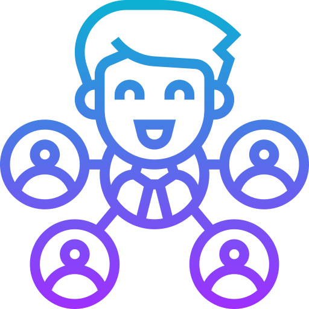

<!-- Improved compatibility of back to top link: See: https://github.com/Cloneee/Restfull-API-CoffeeShop-CNPM/pull/73 -->
<a name="readme-top"></a>

[![Contributors][contributors-shield]][contributors-url]
[![Forks][forks-shield]][forks-url]
[![Stargazers][stars-shield]][stars-url]
[![Issues][issues-shield]][issues-url]
[![MIT License][license-shield]][license-url]
[![LinkedIn][linkedin-shield]][linkedin-url]

<!-- PROJECT LOGO -->
<br />
<div align="center">
  <a href="https://github.com/Cloneee/Restfull-API-CoffeeShop-CNPM">
    
  </a>

  <h3 align="center">Coffeeshop management</h3>

  <p align="center">
    An awesome management system for your coffee shop!
    <br />
    <a href="https://github.com/Cloneee/Restfull-API-CoffeeShop-CNPM"><strong>Explore the docs »</strong></a>
    <br />
    <br />
    <a href="https://youtu.be/rZ2pj6yyza0">View Demo</a>
    ·
    <a href="https://github.com/Cloneee/Restfull-API-CoffeeShop-CNPM">Report Bug</a>
    ·
    <a href="https://github.com/Cloneee/Restfull-API-CoffeeShop-CNPM">Request Feature</a>
  </p>
</div>

<!-- TABLE OF CONTENTS -->
<details>
  <summary>Table of Contents</summary>
  <ol>
    <li>
      <a href="#about-the-project">About The Project</a>
      <ul>
        <li><a href="#built-with">Built With</a></li>
      </ul>
    </li>
    <li>
      <a href="#getting-started">Getting Started</a>
      <ul>
        <li><a href="#prerequisites">Prerequisites</a></li>
        <li><a href="#installation">Installation</a></li>
      </ul>
    </li>
    <li><a href="#usage">Usage</a></li>
    <li><a href="#license">License</a></li>
    <li><a href="#contact">Contact</a></li>
  </ol>
</details>

<!-- ABOUT THE PROJECT -->
## About The Project

[![Product Name Screen Shot][product-screenshot]](https://youtu.be/rZ2pj6yyza0)

<p align="right">(<a href="#readme-top">back to top</a>)</p>

### Built With

* [![React][React.js]][React-url]
* [![Express][Express]][Express-url]
* [![Mongodb][Mongodb]][React-url]

<p align="right">(<a href="#readme-top">back to top</a>)</p>

<!-- GETTING STARTED -->
## Getting Started

This is an example of how you may give instructions on setting up your project locally.
To get a local copy up and running follow these simple example steps.

### Prerequisites

* npm

  ```sh
  npm install npm@latest -g
  ```

### Installation

1. Clone the repo

   ```sh
   git clone https://github.com/Cloneee/Restfull-API-CoffeeShop-CNPM.git
   ```

2. Install NPM packages

   ```sh
   npm install
   ```

3. Create your `.env`

   ```txt
    PORT = 3000
    API_URL = /api/v1
    SALT_ROUND = 10
    SECRET = my-secret
    NODE_ENV = product
    DB_URI = "Your database URI"
   ```

<p align="right">(<a href="#readme-top">back to top</a>)</p>

<!-- USAGE EXAMPLES -->
## Usage

To use this app as backend, please install the [Client](https://github.com/Cloneee/new-coffee-client)

<p align="right">(<a href="#readme-top">back to top</a>)</p>

<!-- LICENSE -->
## License

Distributed under the MIT License. See `LICENSE.txt` for more information.

<p align="right">(<a href="#readme-top">back to top</a>)</p>

<!-- CONTACT -->
## Contact

Nguyễn Thanh Huy - [Huy Thanh Nguyễn](https://fb.com/NTH.Clone) - thanhhuy.0@gmail.com

Project Link: [https://github.com/Cloneee/Restfull-API-CoffeeShop-CNPM](https://github.com/Cloneee/Restfull-API-CoffeeShop-CNPM)

<p align="right">(<a href="#readme-top">back to top</a>)</p>

<!-- MARKDOWN LINKS & IMAGES -->
<!-- https://www.markdownguide.org/basic-syntax/#reference-style-links -->
[contributors-shield]: https://img.shields.io/github/contributors/Cloneee/Restfull-API-CoffeeShop-CNPM.svg?style=for-the-badge
[contributors-url]: https://github.com/Cloneee/Restfull-API-CoffeeShop-CNPM/graphs/contributors
[forks-shield]: https://img.shields.io/github/forks/Cloneee/Restfull-API-CoffeeShop-CNPM.svg?style=for-the-badge
[forks-url]: https://github.com/Cloneee/Restfull-API-CoffeeShop-CNPM/network/members
[stars-shield]: https://img.shields.io/github/stars/Cloneee/Restfull-API-CoffeeShop-CNPM.svg?style=for-the-badge
[stars-url]: https://github.com/Cloneee/Restfull-API-CoffeeShop-CNPM/stargazers
[issues-shield]: https://img.shields.io/github/issues/Cloneee/Restfull-API-CoffeeShop-CNPM.svg?style=for-the-badge
[issues-url]: https://github.com/Cloneee/Restfull-API-CoffeeShop-CNPM/issues
[license-shield]: https://img.shields.io/github/license/Cloneee/Restfull-API-CoffeeShop-CNPM.svg?style=for-the-badge
[license-url]: https://github.com/Cloneee/Restfull-API-CoffeeShop-CNPM/blob/master/LICENSE.txt
[linkedin-shield]: https://img.shields.io/badge/-LinkedIn-black.svg?style=for-the-badge&logo=linkedin&colorB=555
[linkedin-url]: https://www.linkedin.com/in/thanh-huy-nguyễn-7a32b3212/
[product-screenshot]: images/screenshot.png
[React.js]: https://img.shields.io/badge/React-20232A?style=for-the-badge&logo=react
[React-url]: https://reactjs.org/
[Express]: https://img.shields.io/badge/Express-20232A?style=for-the-badge&logo=express
[Express-url]: https://expressjs.com/
[Mongodb]: https://img.shields.io/badge/MongoDB-20232A?style=for-the-badge&logo=mongodb
[Mongodb-url]: https://www.mongodb.com/